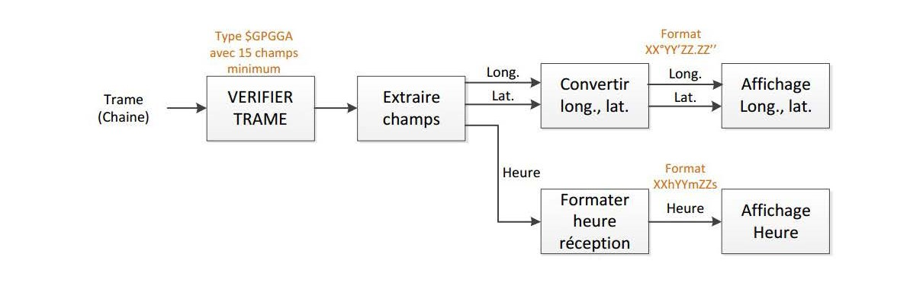

# Mini-Projet C

## Le projet :
Ce **mini-projet en langage C** a été réalisé par Zhao JIN et Axel METZINGER dans le cadre du module M2101 de notre DUT Informatique à l'Université Paul Sabatier.
Celui-ci porte sur **l'analyse de trames GPS** suivant la norme *NMEA 0183* afin de créer une "application de géolocalisation" en ligne de commande (CLI).

Le schéma ci-dessous montre l’enchaînement des traitements que nous devons suivre et qu'il faut appliquer à une trame GPS pour extraire et afficher les informations qu’elle contient.



Un fichier makefile est fourni avec le code, il permet de compiler le programme.
Ce fichier comporte quatre règles :
* `%.o` - la compilation des fichiers `.c` en `.o`
* `main` - l'édition des liens du programme `main`
* `all` -  permet l'édition des liens et la compilation de chaque fichiers du programme
* `clean` - permet la suppression des fichier compilés (`.o`) et de l'exécutable `main`

Un fichier de test comportant une trame respectant la norme GPGGA est fournie : `gpgga_frame.txt`.


## Ressources :
*  [https://en.wikipedia.org/wiki/NMEA_0183](https://en.wikipedia.org/wiki/NMEA_0183)
*  [http://aprs.gids.nl/nmea/](http://aprs.gids.nl/nmea/)


## Documentation :
| [Sommaire des types](#types) |
| ------ |
| [`enum` - Exception](#exception) - énumération contenant les exceptions |
| [`enum` - latOr](#lator) - énumération de l'orientation latitudinale |
| [`enum` - lonOr](#lonor) - énumération de l'orientation longitudinale |
| [`struct` - extractedTime](#extractedtime) - structure contenant le temps formaté |
| [`struct` - extractedPosition](#extractedposition) - structure contenant la position formatée |
| [`struct` - gps](#gps) - structure contenant les différentes données du GPS |

| [Sommaire des fonctions](#fonctions) |
| ------ |
| [`void` - readGPSFrameFromFile](#readgpsframefromfile) - permet la lecture d'une trame GPS depuis un fichier |
| [`void` - inputGPSFrame](#inputgpsframe) - permet la saisie d'une trame GPS | 
| [`void` - syntaxeCheck](#syntaxecheck) - vérifie la syntaxe de la trame saisie | 
| [`void` - extractFields](#extractfields) - extrait les différents champs et les stocks dans une `struct gps` | 
| [`void` - convertTime](#converttime) - convertit l'heure saisie au format HHhMMmSSs | 
| [`void` - convertPosition](#convertposition) - convertit la position au format séxagésimal | 
| [`void` - displayTime](#displaytime) - affiche l'heure | 
| [`void` - displayPosition](#displayposition) - affiche la position | 
| [`void` - saveInFile](#saveinfile) - enregistre l'heure et la position dans un fichier texte | 
| [`int` - checksum](#checksum) - renvoie la somme de parité d'une trame GPS | 


## Types
### Exception

```c
typedef enum {OK, NOT_GPGGA_FRAME, INCORRECT_CHECKSUM, POS_OUT_OF_BOUNDS} Exception;
```

Cette énumération permet de gérer les différentes exceptions relatives aux trames GPS GPGGA :
* `OK` - aucune erreur détéctée
* `NOT_GPGGA_FRAME` - la trame saisie n'est pas une trame GPGGA
* `INCORRECT_CHECKSUM` - le contrôle de parité a échoué
* `POS_OUT_OF_BOUNDS` - la latitude ou la longitude n'est pas comprise dans les valeurs autorisées, la latitude s'étend de 0 à 90 degrés tandis que la longitude est comprise entre 0 et 180 degrés
* `POS_OUT_OF_BOUNDS` - l'heure n'est pas comprise dans les valeurs autorisées, les heures doivent être comprises entre 0 et 24, tandis que les minutes et les secondes doivent être entre 0 et 60

### latOr

```c
typedef enum {N='N', S='S'} latOr;
```

Cette énumération contient les valeurs autorisées pour l'orientation latitudinale.

### lonOr

```c
typedef enum {E='E', W='W'} lonOr;
```

Cette énumération contient les valeurs autorisées pour l'orientation longitudinale.

### extractedTime

```c
struct extractedTime {
    int hours;
    int minutes;
    double seconds;
};
```

Cette structure contient l'heure au format heures, minutes, secondes, tel que :
* `hours` - hh
* `minutes` - mm
* `seconds` - ss.ssss

### extractedPosition

```c
struct extractedPosition {
    struct {
        int degrees;
        int minutes;
        double seconds;
        latOr orientation;  //N ou S
    } latitude;
    struct {
        int degrees;
        int minutes;
        double seconds;
        lonOr orientation;  //E ou W
    } longitude;
};
```

Cette structure contient l'heure au format sexagécimal, aussi appelé DMS, selon la latitude et la longitude.

Format sexagécimal : xx°yy'zz.zz" O
* `degrees` - xx
* `minutes` - yy
* `seconds` - zz.zzzz
* `orientation` - O = (NS) ou (EW)

### gps

```c
typedef struct {
    char * message;
    char extractedMsg[15][20];

    struct extractedPosition position;
    struct extractedTime time;
} gps;
```

Cette structure permet de stocker toutes les données relatives au GPS :
* `message` - chaîne de caractère contenant la trame saisie par l'utilisateur
* `extractedMsg` - tableau contenant chaque information de la trame séparée
* `position` - `struct extractedPosition` contenant la position formatée
* `time` - `struct extractedTime` contenant l'heure formatée


## Fonctions
### readGPSFrameFromFile

```c
void readGPSFrameFromFile(gps * data, char *fileName);
```

Permet au programme de lire une trame GPS depuis un fichier dont le nom est stocké dans fileName

> Parameters :
> * `data` - `struct gps` permettant de retourner la trame lue
> * `fileName` - nom du fichier d'où la trame sera importée

### inputGPSFrame

```c
void inputGPSFrame(gps * data);
```

Permet à l'utilisateur de saisir une trame GPS

> Parameters :
> * `data` - `struct gps` permettant de retourner la trame saisie

### syntaxeCheck

```c
void syntaxCheck(const gps * data, jmp_buf resPt);
```

Vérifie si la trame saisie suit bien la syntaxe GPGGA

> Parameters :
> * `data` - `struct gps` permettant la transmission de la trame saisie
> * `resPt` - point de reprise en cas de levée d'erreur
>
> Throws :
> * `NOT_GPGGA_FRAME` - si la trame saisie n'est pas une trame GPS GPGGA
> * `INCORRECT_CHECKSUM` - si le contrôle de parité est incorrect

### extractFields

```c
void extractFields(gps * data, jmp_buf resPt); 
```

Extrait chaque paquet d'information de la trame GPGGA dans la table `extractedMsg` et stocke la position et l'heure dans les variables `rawLatitude`, `rawLongitude` et `rawTime` de la structure

> Parameters :
> * `data` - `struct gps` permettant le stockage des données extraites
> * `resPt` - point de reprise en cas de levée d'erreur
>
> Throws :
> * `POS_OUT_OF_BOUNDS` - si la latitude n'est pas comprise entre 0 et 90 ou la longitude entre 0 et 180 degrés
> * `TIME_OUT_OF_BOUNDS` -  si les heures ne sont pas comprises entre 0 et 24 ou les minutes ou secondes entre 0 et 60

### convertTime

```c
void convertTime(gps * data);
```

Convertit l'heure au format heures, minutes, secondes et stocke les valeurs dans la structure `time` de la structure en entrée

> Parameters :
> * `data` - `struct gps` permettant le stockage des données converties

### convertPosition

```c
void convertPosition(gps * data);
```

Convertit la position au format sexagécimal selon la latitude et la longitude et stocke les valeurs dans la structure `position` de la structure en entrée

> Parameters :
> * `data` - `struct gps` permettant le stockage des données converties

### displayTime

```c
void displayTime(const gps * data);
```

Affiche l'heure au format : HHhMMmSSs

> Parameters :
> * `data` - `struct gps` contenant la définition de l'heure formatée dans `time`

### displayPosition

```c
void displayPosition(const gps * data);
```

Affiche la position au format : xx°yy'zz.zz" O ; xx°yy'zz.zz" O ; avec O représentant respectivement l'orientation de la latitude et de la longitude

> Parameters :
> * `data` - `struct gps` contenant la définition de la position formatée dans `position`

### saveInFile

```c
void saveInFile(const gps * data, char *fileName);
```

Exporte l'heure et la position extraits de la trame stockée dans la `struct gps` dans un fichier dont le nom est stocké dans fileName

> Parameters :
> * `data` - `struct gps` contenant la définition de l'heure et de la position formatée dans `time` et `position`
> * `fileName` - nom du fichier où le résultat sera exporté

### checksum

```c
int checksum(const char * s);
```

Calcule la valeur du contrôle de parité

> Parameters :
> * `s` - chaîne de caractère de la trame entre les symboles `$` et `*`
